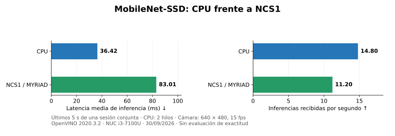
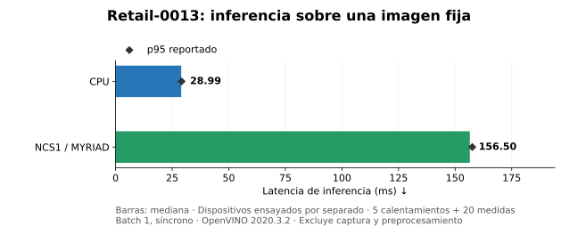

# Intel NCS Legacy Lab

Guía en español para reutilizar **Intel Movidius Neural Compute Stick (NCS1)** y documentar las pruebas con **Intel Neural Compute Stick 2 (NCS2)** en una Intel NUC con Ubuntu 24.04. El objetivo es didáctico: preparar un entorno de inferencia, identificar qué ejecuta cada dispositivo y comparar CPU y acelerador con mediciones verificables.

**Estado documentado: 30 de septiembre de 2026.** NCS1 ejecuta inferencia con OpenVINO 2020.3.2 en un contenedor Ubuntu 18.04. NCS2 aparece por USB y el plugin MYRIAD está disponible en OpenVINO 2022.3.2, pero la carga del firmware falla en este equipo. En las pruebas disponibles la CPU es más rápida que el NCS1.

## Equipo y versiones

| Componente | Equipo utilizado |
|---|---|
| Computadora | Intel NUC7i3BNK, placa NUC7i3BNB |
| CPU | Intel Core i3-7100U, 2 núcleos / 4 hilos |
| Memoria y almacenamiento | 8 GB RAM, SSD de 128 GB |
| Anfitrión | Ubuntu 24.04.4 LTS, kernel observado `7.0.0-34-generic` |
| Cámara | Intel RealSense D435i, RGB por V4L2, 640 × 480 a 15 fps |
| NCS1 | Myriad 2; USB inicial `03e7:2150`, boot observado `03e7:f63b` |
| NCS2 | Myriad X; USB inicial `03e7:2485` |
| Entorno NCS1 | Ubuntu 18.04, Python 3.6, OpenVINO 2020.3.2 |
| Entorno NCS2 | Ubuntu 20.04, Python 3.8, OpenVINO 2022.3.2 |

La identificación inicial propuesta era NUC5i7RYB; la inspección DMI de la máquina utilizada confirmó NUC7i3BNK / NUC7i3BNB. No se afirma que todas las NUC usadas en OP3 tengan esta configuración. Para verificar otro equipo: `cat /sys/class/dmi/id/product_name /sys/class/dmi/id/board_name`, `lscpu` y `uname -r`.

## Por qué usar contenedores

Un `venv` aísla paquetes Python, pero no sustituye las bibliotecas nativas, el plugin MYRIAD, el firmware ni los permisos USB. Se conservaron Ubuntu 24.04 y Python del anfitrión, y se instalaron versiones antiguas dentro de contenedores separados. El contenedor sigue usando el kernel y la conexión USB del anfitrión: no equivale a arrancar físicamente Ubuntu 18.04 o 20.04.

Aquí hablamos de **reutilización de hardware legado** y de un entorno compatible con versiones anteriores. No es una garantía de retrocompatibilidad para cualquier modelo, sistema operativo o stick.

## Inicio con NCS1

Ejecutar en la NUC x86_64, desde su escritorio gráfico. Se necesita conexión a Internet para descargar los archivos de Intel y los pesos originales del modelo.

```bash
git clone https://github.com/GerardoDC14/intel-ncs-legacy-lab.git
cd intel-ncs-legacy-lab
./scripts/setup-host.sh
# Cerrar sesión y volver a entrar para aplicar los grupos USB/vídeo.
# Reconectar el stick después de aplicar las reglas USB.
./scripts/build-runtime.sh ncs1
./scripts/prepare-mobilenet.sh
./ncs1/live.sh both
```

El instalador del anfitrión instala Docker, FFmpeg y herramientas USB/V4L2; añade el usuario a `plugdev` y `video` y escribe reglas udev para los IDs observados de Movidius. Los lanzadores usan `sudo docker` y ejecutan el contenedor con el UID del usuario. Las descargas de Intel se validan como archivos tar y se registra su SHA256 local; ese registro por sí mismo **no es una verificación contra un hash del fabricante**. Los pesos y el prototxt de MobileNet sí se verifican contra hashes fijados en el script.

Modos disponibles:

```bash
./ncs1/live.sh cpu
./ncs1/live.sh myriad
./ncs1/live.sh both --threshold 0.3
./ncs1/live.sh both --seconds 30
```

**Q o Esc** cierra el visor. No abrir dos lanzadores a la vez: compiten por cámara y stick. `both` ejecuta un proceso por dispositivo y muestra dos paneles de una sola captura RGB. Cada panel dibuja las cajas sobre el fotograma que realmente procesó. Se descartan fotogramas pendientes para evitar una cola creciente.

Se conserva el encabezado con latencia, inferencias/s, personas y antigüedad del resultado. Una sola gráfica inferior muestra los últimos 30 segundos de latencia, promedios de 5 segundos y diferencia `NCS1 − CPU`. Un valor positivo indica mayor latencia del NCS1. La tasa de inferencias/s cuenta los resultados recibidos en la ventana de 5 segundos; no se calcula como el inverso de la latencia.

El visor utiliza el socket Xwayland y las credenciales de la sesión gráfica actual, sin `xhost +`. No se valida ejecución gráfica sobre SSH sin escritorio local. Detecta una cámara RGB YUYV mediante V4L2; si hay varias, elegir explícitamente:

```bash
NCS_CAMERA=/dev/video4 ./ncs1/live.sh both
```

El número puede cambiar al reconectar. La D435i también expone profundidad e infrarrojo; esta guía utiliza solo RGB. La cámara funcionó conectada al hub tras reconectarla. Los errores USB `-71` observados anteriormente se recuperaron con reconexión física; no se estableció su causa.

## Modelo utilizado

El primer detector, `person-detection-retail-0013`, no detectaba adecuadamente a la persona sentada y parcialmente fuera de cuadro. Se sustituyó por **MobileNet-SSD Caffe, VOC**, de [chuanqi305/MobileNet-SSD](https://github.com/chuanqi305/MobileNet-SSD), convertido a IR FP16 con Model Optimizer 2020.3.355.

Entrada BGR de 300 × 300, media 127.5 y escala 127.5 integradas en el IR; el visor entrega píxeles sin normalizarlos otra vez. La clase persona es `15` en VOC y el umbral inicial es 0.4. [Procedencia y conversión](docs/modelos.md).

La ejecución del modelo en CPU y NCS1 fue validada. **La mejora para personas sentadas aún no está confirmada**: la prueba guardada de MobileNet mostró una silla vacía. La velocidad y la calidad de detección deben evaluarse por separado. Bajar el umbral puede aumentar falsos positivos.

## Comparativa medida



La gráfica corresponde al promedio de los últimos 5 segundos de una sesión con ambos dispositivos, CPU con 2 hilos y cámara a 15 fps. Se capturaron 125 fotogramas. CPU: **36.42 ms / 14.8 inferencias/s**. NCS1: **83.01 ms / 11.2 inferencias/s**. Diferencia de latencia: **+46.60 ms**, aproximadamente **2.28 veces** la latencia de CPU. No se midió consumo eléctrico ni uso global de CPU.



Esta segunda prueba usa otro modelo: retail-0013, imagen fija, batch 1, inferencia síncrona, 5 calentamientos y 20 medidas por dispositivo, ejecutados por separado. Mediana CPU: **28.99 ms**; NCS1: **156.50 ms**. No incluye captura ni preprocesamiento. No debe combinarse con la sesión MobileNet para atribuir una mejora del modelo o del runtime.

Las cifras ilustran diferencias de ejecución en este equipo. El valor de la práctica está en comprender el envío de un grafo a una VPU, los permisos, el firmware, la selección explícita de dispositivo y los límites de una medición. No se busca demostrar que el acelerador siempre gana.

[Metodología, datos y resultados adicionales](docs/mediciones.md). Todos los gráficos pueden regenerarse con:

```bash
python3 -m venv .venv
.venv/bin/pip install -r scripts/requirements-plots.txt
.venv/bin/python scripts/plot_results.py
```

## Fallo conocido del NCS1

Después de varias aperturas se observó `NC_ERROR` al reinicializar el stick. El procedimiento que el usuario confirmó como recuperación es:

1. Cerrar el visor.
2. Desconectar y reconectar físicamente el NCS1.
3. Abrir nuevamente el modo deseado.

Es un procedimiento de recuperación observado; no se ha identificado ni corregido la causa. Se decidió no profundizar en ese fallo por ahora. El proceso MYRIAD no usa CPU como sustituto silencioso.

## Estado del NCS2

Se preparó Ubuntu 20.04 / Python 3.8 / OpenVINO 2022.3.2 y se verificó inferencia CPU. El NCS2 se enumera por USB, pero al compilar para MYRIAD aparece:

```text
Failed to find booted device after boot
RuntimeError: Failed to allocate graph: MYRIAD device is not opened.
```

Se repitió con permisos habituales y acceso completo de diagnóstico, red del anfitrión y udev, libusb sin udev y OpenVINO 2022.3.1. Ninguna variante produjo inferencia NCS2. **No hay valores de latencia NCS2 que graficar.** Que `Core().available_devices` incluya `MYRIAD` confirma disponibilidad del plugin, no la ejecución del stick.

[Proceso, hipótesis y punto de detención](docs/ncs2.md). Los archivos de `ncs2/` permiten reconstruir el entorno de diagnóstico, pero no representan una solución comprobada:

```bash
./scripts/build-runtime.sh ncs2
./ncs2/run.sh python /work/check_ncs2.py
```

## Organización y alcance

- `ncs1/`: runtime, visor y benchmark estático.
- `ncs2/`: entorno de diagnóstico y benchmark CPU/MYRIAD explícito.
- `scripts/`: preparación del anfitrión, descarga/conversión y gráficos.
- `results/`: mediciones originales numéricas y extracto del error NCS2.
- `docs/`: contexto, método, fuentes y limitaciones.
- `figures/`: gráficas SVG y PNG generadas exclusivamente a partir de los datos.

No se publican capturas de cámara, imágenes de detección, pesos de terceros ni archivos de autenticación. El código público del visor no guarda imágenes; escribe métricas locales al cerrar. Los pesos y runtimes se descargan de sus fuentes y conservan sus propias condiciones de licencia. El código y la documentación propios del laboratorio se distribuyen bajo MIT.
