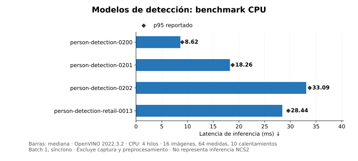

# Mediciones y límites de la comparación

## Sesión MobileNet-SSD CPU / NCS1

Fuente: [mobilenet-live.json](../results/mobilenet-live.json), guardada el 30 de septiembre de 2026. Ambos dispositivos estaban activos en la misma sesión; captura 640 × 480 a 15 fps, un proceso por dispositivo, CPU con 2 hilos y un stream. Se capturaron 125 fotogramas. Los valores comparados corresponden a los últimos 5 segundos del visor, no a la media de toda la sesión.

| Dispositivo | Media de inferencia en 5 s (ms) | Resultados recibidos/s en 5 s |
|---|---:|---:|
| CPU | 36.4182 | 14.8 |
| NCS1 / MYRIAD | 83.0147 | 11.2 |

La latencia mide solo `infer()`. La tasa real también está condicionada por captura, resize, dibujo, planificación, colas y recepción de resultados. Por eso no equivale a `1000 / ms`. La CPU está cerca del límite de 15 fps de la cámara; no es una medida de su máximo rendimiento sin captura.

No hay serie temporal cruda guardada para esta sesión; se publica una gráfica de los agregados disponibles. No se inventan curvas retrospectivas, intervalos de confianza ni percentiles para estos valores. La gráfica del visor sí recoge muestras durante su propia ejecución. No hubo errores de inferencia. La escena guardada estaba vacía y no permite evaluar detección de personas sentadas.

## Benchmark estático retail-0013, OpenVINO 2020.3.2

Fuentes: [CPU](../results/retail-static-CPU.json), [MYRIAD](../results/retail-static-MYRIAD.json). Imagen fija, batch 1, inferencia síncrona, 5 calentamientos, 20 iteraciones; dispositivos ensayados por separado y configuración CPU por defecto. La imagen se preprocesó antes del bucle. Captura, preprocesamiento, carga del modelo y dibujo no están incluidos en la latencia.

| Dispositivo | Mediana (ms) | p95 (ms) |
|---|---:|---:|
| CPU | 28.9878 | 29.1355 |
| NCS1 / MYRIAD | 156.5033 | 157.5699 |

Los JSON originales de esta prueba conservan agregados, no las 20 duraciones individuales. El marcador p95 es un percentil reportado, no una barra de error ni intervalo de confianza. No hubo detecciones por encima de 0.5 en la escena original sentada/parcial.

## Cuatro modelos CPU, OpenVINO 2022.3.2

Fuente: [CSV](../results/openvino2022-cpu.csv) y JSON `*-CPU.json` con las 64 duraciones por modelo. Batch 1, una solicitud síncrona, 4 hilos CPU, un stream, 10 calentamientos, 64 medidas usando 16 imágenes repetidas cuatro veces. Umbral 0.5. Preprocesamiento BGR y etiqueta persona por modelo.

| Modelo | Mediana inferencia (ms) | p95 (ms) | Imágenes con detección / 16 |
|---|---:|---:|---:|
| person-detection-0200 | 8.62 | 8.98 | 2 |
| person-detection-0201 | 18.26 | 18.79 | 2 |
| person-detection-0202 | 33.09 | 33.77 | 8 |
| person-detection-retail-0013 | 28.44 | 29.60 | 0 |

La columna de detecciones no es exactitud ni recall: no existe verdad de referencia etiquetada, ni se verificaron falsos positivos o falsos negativos sistemáticamente. No se grafica como calidad. La escena contenía una persona sentada y parcialmente fuera de cuadro.

`pipeline_*` en los archivos incluye resize, inferencia y filtrado de cajas, pero excluye captura, decodificación, visualización y escritura. `serial_pipeline_fps` es una tasa calculada para ese bucle, no FPS de la cámara. Estos ensayos no incluyen ejecución NCS2.

## Lo que puede concluirse

La CPU mostró menor latencia que NCS1 en las dos comparaciones con el mismo modelo dentro de cada ensayo. No se ha medido ahorro energético, precisión estadística, rendimiento en otros equipos, concurrencia con cargas externas ni una mejora causal al cambiar retail por MobileNet. Los runtimes, modelos, hilos y métodos de los distintos ensayos no son equivalentes.

## Repetir y extender la práctica

1. Usar el mismo modelo, precisión y datos para CPU y MYRIAD; comprobar selección explícita de dispositivo.
2. Registrar equipo, kernel, versiones, cámara, resolución, configuración de hilos, calentamiento e iteraciones.
3. Separar carga del modelo, inferencia, pipeline y captura. Guardar muestras individuales antes de calcular mediana y p95.
4. Para evaluar detección, obtener escenas etiquetadas con personas sentadas, de pie y ocluidas. Medir calidad aparte de velocidad.
5. Si se estudia consumo, incorporar una medición eléctrica y energía por inferencia; no inferirla a partir de latencia.

El benchmark público `ncs1/work/benchmark.py` permite aportar una imagen propia y guardar duraciones individuales. Las capturas originales no se distribuyen. La reconstrucción de los scripts de preparación se revisó con comprobaciones estáticas; la ejecución física documentada corresponde al laboratorio original, no a una segunda instalación limpia desde este repositorio.
